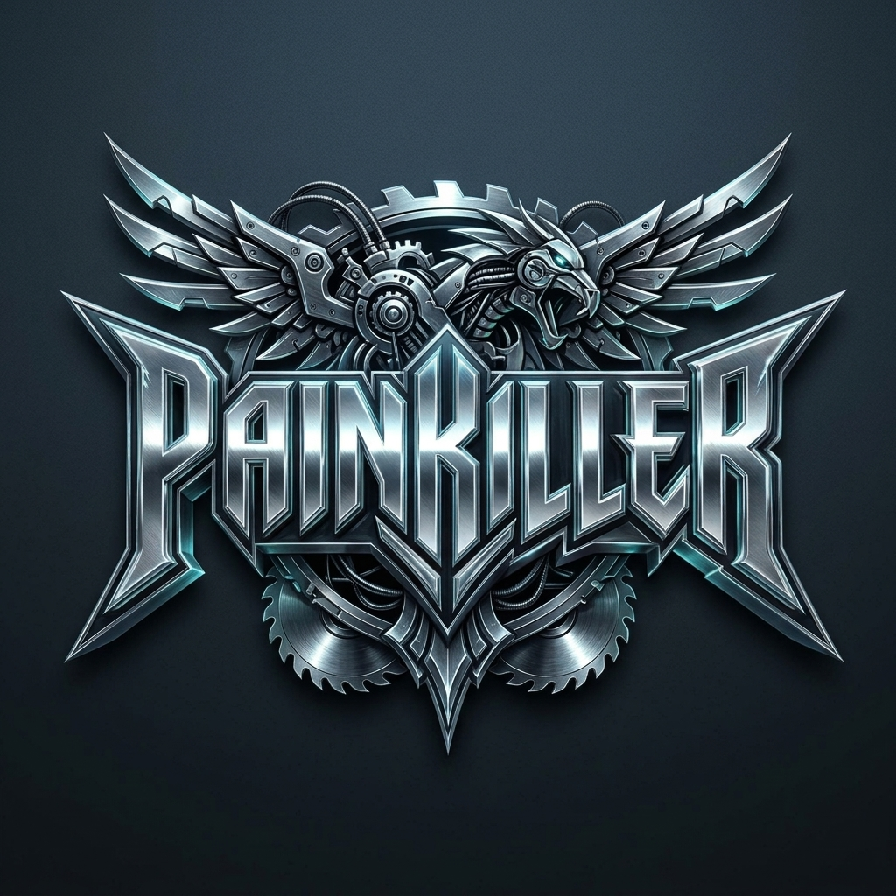
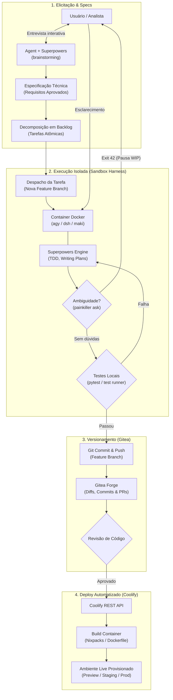

<p align="center">
  
</p>

# Painkiller

Painkiller is a self-hosted platform that turns software specifications into deployed applications using autonomous coding agents.

Instead of pasting prompts back and forth in a chat window, Painkiller runs agents inside isolated Docker containers, gives them structured software engineering workflows, tracks their code in Git, and deploys preview environments automatically.

---

## What It Orchestrates

Painkiller ties four core pieces together:

### 1. Agentic Harnesses
Agents run inside ephemeral Docker sibling containers with filesystem isolation. Painkiller supports multiple CLI harnesses:
- **`agy`** (Antigravity CLI powered by Gemini)
- **`dsh`** (DeepSeek Harness)
- **`maki`** (Rust-based coding agent)
- **`more coming soon`**

**Clean interruption protocol (Exit 42):** When an agent hits an ambiguous requirement, it doesn't guess or hallucinate. It runs `painkiller ask "<question>"`, commits its current work-in-progress, and exits with code `42`. The task pauses in the UI until you answer, then resumes on the exact same branch.

### 2. Superpowers
Agents don't write code blindly. Painkiller equips them with [Superpowers](https://github.com/obra/superpowers) — structured skills for the development lifecycle:
- **Brainstorming & Elicitation:** Interactive interview to refine project specs before any code is touched.
- **Decomposition:** Breaking specifications into small, testable, atomic tasks.
- **Execution & TDD:** Following test-driven development and verification loops for every task.

### 3. Gitea
An embedded, self-hosted Git forge. Every project gets its own repository:
- Each task runs on a dedicated feature branch.
- Intermediate commits, WIP snapshots, and diffs are tracked in Git.
- Code and pull requests can be reviewed directly in the web UI.

### 4. Coolify
Painkiller integrates with [Coolify](https://coolify.io) to turn Git branches into live environments. Once tasks pass automated tests and review, Painkiller triggers Coolify to build and deploy preview or production instances with dedicated URLs.

---

## How It Works



1. **Interview:** You describe what you want to build. An agent interviews you to flesh out requirements and architecture.
2. **Backlog:** Painkiller decomposes the approved spec into atomic backlog tasks.
3. **Dispatch:** A containerized agent boots up on a clean branch, implements the task using TDD, and runs tests.
4. **Clarification (if needed):** If the agent hits ambiguity, it pauses cleanly (`Exit 42`) and asks for human feedback.
5. **Review & Deploy:** Code is committed to Gitea and automatically deployed to Coolify.

---

## Quickstart

### Prerequisites
- Docker & Docker Compose
- API key for your chosen provider (`GEMINI_API_KEY` or `DEEPSEEK_API_KEY`)

### Running with Docker Compose

1. Clone the repo and configure `.env`:
   ```bash
   cp .env.example .env
   # Set your PAINKILLER_HOST_ROOT, GITEA password, and LLM keys in .env
   ```

2. Build and start the services:
   ```bash
   docker compose --profile build build
   docker compose up -d
   ```

3. Open `http://localhost:8000` in your browser.

