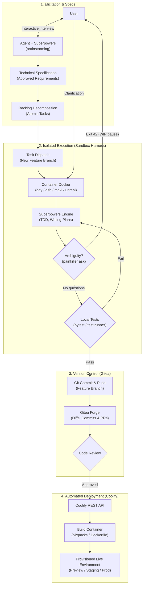

<p align="center">
  
</p>

# Painkiller

Painkiller is a self-hosted platform that turns rough ideas into deployed applications through collaborative brainstorming, spec-driven development (SDD), and autonomous coding agents.

Instead of pasting prompts back and forth in a chat window, Painkiller brainstorms specifications with you, decomposes tasks, runs agents inside isolated Docker containers, tracks code in Git, and deploys preview environments automatically.

---

## What It Orchestrates

Painkiller ties four core pieces together:

### 1. Agentic Harnesses
Agents run inside ephemeral Docker sibling containers with filesystem isolation. Painkiller supports multiple CLI harnesses:
- **`agy`** (Antigravity CLI powered by Gemini)
- **`dsh`** (DeepSeek Harness)
- **`maki`** (Rust-based coding agent)
- **`unreal`** (Go-based Unreal Agent powered by DeepSeek)

**Clean interruption protocol (Exit 42):** When an agent hits an ambiguous requirement, it doesn't guess or hallucinate. It runs `painkiller ask "<question>"`, commits its current work-in-progress, and exits with code `42`. The task pauses in the UI until you answer, then resumes on the exact same branch.

### 2. Superpowers
Agents don't write code blindly. Painkiller equips them with [Superpowers](https://github.com/obra/superpowers) — structured skills for the development lifecycle:
- **Brainstorming & Elicitation:** Interactive interview to refine project specs before any code is touched.
- **Decomposition:** Breaking specifications into small, testable, atomic tasks.
- **Execution & TDD:** Following test-driven development and verification loops for every task.

### 3. Gitea
An embedded, self-hosted Git forge. Every project gets its own repository:
- Each task runs on a dedicated feature branch.
- Intermediate commits, WIP snapshots, and diffs are tracked in Git.
- Code and pull requests can be reviewed directly in the web UI.

### 4. Coolify
Painkiller integrates with [Coolify](https://coolify.io) to turn Git branches into live environments. Once tasks pass automated tests and review, Painkiller triggers Coolify to build and deploy preview or production instances with dedicated URLs.

---

## How It Works



1. **Interview:** You describe what you want to build. An agent interviews you to flesh out requirements and architecture.
2. **Backlog:** Painkiller decomposes the approved spec into atomic backlog tasks.
3. **Dispatch:** A containerized agent boots up on a clean branch, implements the task using TDD, and runs tests.
4. **Clarification (if needed):** If the agent hits ambiguity, it pauses cleanly (`Exit 42`) and asks for human feedback.
5. **Review & Deploy:** Code is committed to Gitea and automatically deployed to Coolify.

---

## Quickstart

### Prerequisites
- Docker & Docker Compose
- An API key per project for its harness's provider (Google Gemini or DeepSeek), entered when the project is created — there is no server-wide LLM key

### One command

```bash
./linux-run.sh        # Linux
./mac-run.sh          # macOS
powershell -ExecutionPolicy Bypass -File .\win-run.ps1   # Windows
```

The script checks Docker/Compose, creates `.env` from `.env.example`, generates the Gitea service-account password, builds **every** image (including each harness's worker and agent), verifies them and waits for the API. Use `--skip-build` / `-SkipBuild` to only start.

### Running with Docker Compose manually

1. Clone the repo and configure `.env`:
   ```bash
   cp .env.example .env
   # Set PAINKILLER_GITEA_PASSWORD in .env (everything else is configured in the browser)
   ```

2. Build and start the services:
   ```bash
   docker network create coolify   # once per machine; owned by Coolify, external to compose
   docker compose --profile build build
   docker compose up -d
   ```

3. Open `http://localhost:8000` right away: a fresh install asks you to **create the administrator** (username and password, stored hashed in the database). Whoever gets there first owns the instance. Forgot the password? `docker compose exec api painkiller admin-reset && docker compose restart api` reopens the first access.

### First-run setup wizard

Right after the first access, the admin lands on a wizard (`/setup`, later at **Admin → Configurações**, `/admin/settings`):

1. **Ambiente** — public URL (prefilled from the browser), the host path of `./storage` (detected by the API inspecting its own container) with a "Testar montagem" button, and checks for Docker and the harness images.
2. **Login com Google** (optional, skippable) — a step-by-step for the Google Cloud Console with both redirect URIs ready to copy.
3. **Coolify** (optional, skippable) — **"Configurar automaticamente"** creates Coolify's root account, enables its API and issues a root token by running `php artisan tinker` inside `painkiller-coolify` through the Docker socket; the generated credentials are shown once and kept encrypted. A manual path with direct links to Coolify's register, Settings → Advanced and API Tokens pages is there as a fallback.

All of it lives in the SQLite database, never in the `.env`, and applies without a restart. A random key generated on first boot signs sessions and encrypts the stored secrets. The `.env` keeps only infrastructure settings (images, ports, the Gitea service-account password).

